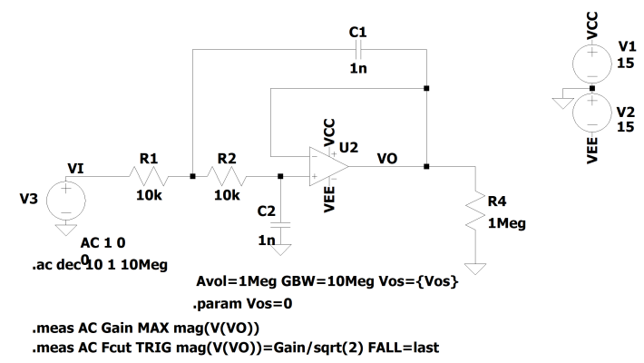
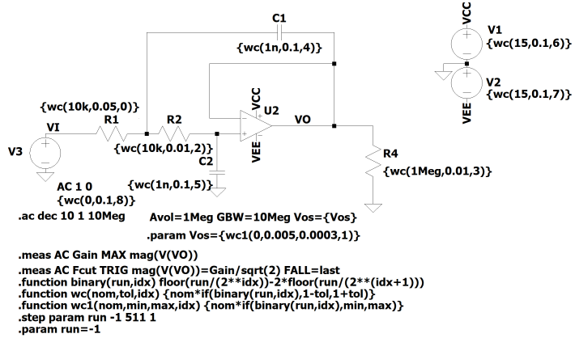

# README #

PyLTSpice is a toolchain of python utilities design to interact with LTSpice Electronic Simulator.
It is mostly based on the spicelib package, being the main difference to it is 
the fact that LTSpice is automatically selected to perform all simulations.

## What is contained in this repository ##

* __LTSteps.py__
  An utility that extracts from LTSpice output files data, and formats it for import in a spreadsheet, such like Excel
  or Calc.

* __raw_read.py__
  A pure python class that serves to read raw files into a python class.

* __raw_write.py__
  A class to write RAW files that can be read by LTSpice Wave Application.

* __spice_editor.py and asc_editor.py__
  Scripts that can update spice netlists. The following methods are available to manipulate the component values,
  parameters as well as the simulation commands. These methods allow to update a netlist without having to open the
  schematic in LTSpice. The simulations can then be run in batch mode (see sim_runner.py).

    - `set_element_model('D1', '1N4148') # Replaces the Diode D1 with the model 1N4148`
    - `set_component_value('R2', '33k') # Replaces the value of R2 by 33k`
    - `set_parameters(run=1, TEMP=80) # Creates or updates the netlist to have .PARAM run=1 or .PARAM TEMP=80`
    - `add_instructions(".STEP run -1 1023 1", ".dc V1 -5 5")`
    - `remove_instruction(".STEP run -1 1023 1")  # Removes previously added instruction`
    - `reset_netlist() # Resets all edits done to the netlist.`

* __sim_runner.py__
  A python script that can be used to run LTSpice simulations in batch mode without having to open the LTSpice GUI.
  This in cooperation with the classes defined in spice_editor.py or asc_editor.py is useful because:

    - Can overcome the limitation of only stepping 3 parameters
    - Different types of simulations .TRAN .AC .NOISE can be run in a single batch
    - The RAW Files are smaller and easier to treat
    - When used with the RawRead.py and LTSteps.py, validation of the circuit can be done automatically.
    - Different models can be simulated in a single batch, by using the following instructions:

  Note: It was only tested with Windows based installations.

* __Analysis Toolkit__
  A set of tools that prepare an LTSpice netlist for a Montecarlo or Worst Case Analysis. The device tolerances are set
  by the user and the netlist is updated accordingly. The netlist can then be used with the sim_runner.py to run a 
  batch of simulations or with the LTSpice GUI.

* __Histogram.py__
  A python script that uses numpy and matplotlib to create a histogram and calculate the sigma deviations. This is
  useful for Monte-Carlo analysis.

## How to Install ##

`pip install PyLTSpice `

### Updating PyLTSpice ###

`pip install --upgrade PyLTSpice `

### Using GITHub ###

`git clone https://github.com/nunobrum/PyLTSpice.git `

If using this method it would be good to add the path where you cloned the site to python path.

`import sys `  
`sys.path.append(<path to PyLTSpice>) `

## How to use ##

Here follows a quick outlook on how to use each of the tools.

More comprehensive documentation can be found in https://pyltspice.readthedocs.io/en/latest/

## LICENSE ##

GNU V3 License
(refer to the LICENSE file)

### RawRead ###

The example below reads the data from a Spice Simulation called
"TRAN - STEP.raw" and displays all steps of the "I(R1)" trace in a matplotlib plot

```python
from PyLTSpice import RawRead

from matplotlib import pyplot as plt

LTR = RawRead("TRAN - STEP.raw")

print(LTR.get_trace_names())
print(LTR.get_raw_property())

IR1 = LTR.get_trace("I(R1)")
x = LTR.get_trace('time')  # Gets the time axis
steps = LTR.get_steps()
for step in range(len(steps)):
    # print(steps[step])
    plt.plot(x.get_wave(step), IR1.get_wave(step), label=steps[step])

plt.legend()  # order a legend
plt.show()
```   

### RawWrite ###

The following example writes a RAW file with a 3 milliseconds transient simulation sine with a 10kHz and a cosine with
9.997kHz

```python
import numpy as np
from PyLTSpice import Trace, RawWrite

LW = RawWrite(fastacces=False)
tx = Trace('time', np.arange(0.0, 3e-3, 997E-11))
vy = Trace('N001', np.sin(2 * np.pi * tx.data * 10000))
vz = Trace('N002', np.cos(2 * np.pi * tx.data * 9970))
LW.add_trace(tx)
LW.add_trace(vy)
LW.add_trace(vz)
LW.save("teste_snippet1.raw")
```   

### SpiceEditor, AscEditor and SimRunner.py ###

This module is used to launch LTSPice simulations. Results then can be processed with either the RawRead or with the
LTSteps module to read the log file which can contain .MEAS results.

The script will firstly invoke the LTSpice in command line to generate a netlist, and then this netlist can be updated
directly by the script, in order to change component values, parameters or simulation commands.

Here follows an example of operation.

```python
from PyLTSpice import SimRunner
from PyLTSpice import SpiceEditor

# select spice model
LTC = SimRunner(output_folder='./temp')
LTC.create_netlist('Batch_Test.asc')
netlist = SpiceEditor('Batch_Test.net')
# set default arguments
netlist.set_parameters(res=0, cap=100e-6, run=-1)
netlist.set_component_value('R2', '2k')  # Modifying the value of a resistor
netlist.set_component_value('R1', '4k')
netlist.set_element_model('V3', "SINE(0 1 3k 0 0 0)")  # Modifying the
netlist.set_component_value('XU1:C2', 20e-12)  # modifying a define simulation
netlist.add_instructions(
    "; Simulation settings",
    ".save V(Vin) I(R1)",
)

for opamp in ('AD712', 'AD820'):
    netlist.set_element_model('XU1', opamp)
    for supply_voltage in (5, 10, 15):
        netlist.set_component_value('V1', supply_voltage)
        netlist.set_component_value('V2', -supply_voltage)
        print("simulating OpAmp", opamp, "Voltage", supply_voltage)
        LTC.run(netlist)

for raw, log in LTC:
    print("Raw file: %s, Log file: %s" % (raw, log))
    # do something with the data
    # raw_data = RawRead(raw)
    # log_data = LTSteps(log)
    # ...

netlist.reset_netlist()
netlist.add_instructions(
    "; Simulation settings",
    ".ac dec 30 10 1Meg",
    ".meas AC Gain MAX mag(V(out)) ; find the peak response and call it ""Gain""",
    ".meas AC Fcut TRIG mag(V(out))=Gain/sqrt(2) FALL=last"
)

# Sim Statistics
print('Successful/Total Simulations: ' + str(LTC.okSim) + '/' + str(LTC.runno))

enter = input("Press enter to delete created files")
if enter == '':
    LTC.file_cleanup()
```

The example above is using the SpiceEditor to create and modify a spice netlist, but it is also possible to use the
AscEditor to directly modify the .asc file. The edited .asc file can then be opened by the LTSpice GUI and the
simulation can be run from there.

### Simulation Analysis Toolkit ###

The AscEditor can be used with the Simulation Analysis Toolkit to perform Monte Carlo or Wost Case simulations.
These simulations can either be done on the LTSpice GUI or using the Runner Class described above.

Let's consider the following circuit:



When performing a Monte Carlo simulation on this circuit, we need to manually modify the value of each component, 
and then add the .step command for making several runs on the same circuit. 
To simplify this process, the AscEditor class can be used as exemplified below:

```python
from PyLTSpice import AscEditor, SimRunner  # Imports the class that manipulates the asc file
from PyLTSpice.sim.tookit.montecarlo import Montecarlo  # Imports the Montecarlo toolkit class

sallenkey = AscEditor("./testfiles/sallenkey.asc")  # Reads the asc file into memory
runner = SimRunner(output_folder='./temp_mc')  # Instantiates the runner class, with the output folder already set
mc = Montecarlo(sallenkey, runner)  # Instantiates the Montecarlo class, with the asc file already in memory

# The following lines set the default tolerances for the components
mc.set_tolerance('R', 0.01)  # 1% tolerance, default distribution is uniform
mc.set_tolerance('C', 0.1, distribution='uniform')  # 10% tolerance, explicit uniform distribution
mc.set_tolerance('V', 0.1, distribution='normal')  # 10% tolerance, but using a normal distribution

# Some components can have a different tolerance
mc.set_tolerance('R1', 0.05)  # 5% tolerance for R1 only. This only overrides the default tolerance for R1

# Tolerances can be set for parameters as well
mc.set_parameter_deviation('Vos', 3e-4, 5e-3, 'uniform')  # The keyword 'distribution' is optional
mc.prepare_testbench(num_runs=1000)  # Prepares the testbench for 1000 simulations

# Finally the netlist is saved to a file
mc.save_netlist('./testfiles/sallenkey_mc.net')

mc.run(100)  # Runs the simulation with splits of 100 runs each
logs = mc.read_logfiles()   # Reads the log files and stores the results in the results attribute
logs.export_data('./temp_mc/data.csv')  # Exports the data to a csv file
logs.plot_histogram('fcut')  # Plots the histograms for the results
mc.cleanup_files()  # Deletes the temporary files
```
When opening the created sallenkey_mc.net file, we can see that the following circuit.


The following updates were made to the circuit:
- The value of each component was replaced by a function that generates a random value within the specified tolerance.
- The .step param run command was added to the netlist. Starts at -1 which it's the nominal value simulation, and 
finishes that the number of simulations specified in the prepare_testbench() method.
- A default value for the run parameter was added. This is useful if the .step param run is commented out.
- The R1 tolerance is different from the other resistors. This is because the tolerance was explicitly set for R1.
- The Vos parameter was added to the .param list. This is because the parameter was explicitly set using the
set_parameter_deviation method.
- Functions utol, ntol and urng were added to the .func list. These functions are used to generate random values.
Uniform distributions use the LTSpice built-in mc(x, tol) and flat(x) functions, while normal distributions use the 
gauss(x) function.

Similarly, the worst case analysis can also be setup by using the class WorstCaseAnalysis, as exemplified below:

```python
from PyLTSpice import AscEditor, SimRunner  # Imports the class that manipulates the asc file
from PyLTSpice.sim.tookit.worst_case import WorstCaseAnalysis

sallenkey = AscEditor("./testfiles/sallenkey.asc")  # Reads the asc file into memory
runner = SimRunner(output_folder='./temp_wca')  # Instantiates the runner class, with the output folder already set
wca = WorstCaseAnalysis(sallenkey, runner)  # Instantiates the Worst Case Analysis class

# The following lines set the default tolerances for the components
wca.set_tolerance('R', 0.01)  # 1% tolerance
wca.set_tolerance('C', 0.1)  # 10% tolerance
wca.set_tolerance('V', 0.1)  # 10% tolerance. For Worst Case analysis, the distribution is irrelevant

# Some components can have a different tolerance
wca.set_tolerance('R1', 0.05)  # 5% tolerance for R1 only. This only overrides the default tolerance for R1

# Tolerances can be set for parameters as well.
wca.set_parameter_deviation('Vos', 3e-4, 5e-3)

# Finally the netlist is saved to a file
wca.save_netlist('./testfiles/sallenkey_wc.asc')


wca.run()  # Runs the simulation with splits of 100 runs each
logs = wca.read_logfiles()   # Reads the log files and stores the results in the results attribute
logs.export_data('./temp_wca/data.csv')  # Exports the data to a csv file

print("Worst case results:")
for param in ('fcut', 'fcut_FROM'):
    print(f"{param}: min:{logs.min_measure_value(param)} max:{logs.max_measure_value(param)}")

wca.cleanup_files()  # Deletes the temporary files
```
When opening the created sallenkey_wc.net file, we can see that the following circuit.



The following updates were made to the circuit:
- The value of each component was replaced by a function that generates a nominal, minimum and maximum value depending
on the run parameter and is assigned a unique index number. (R1=0, Vos=1, R2=2, ... V2=7, VIN=8)
The unique number corresponds to the bit position of the run parameter. Bit 0 corresponds to the minimum value and
bit 1 corresponds to the maximum value. Calculating all possible permutations of maximum and minimum values for each
component, we get 2**9 = 512 possible combinations. This maps into a 9 bit binary number, which is the run parameter.
- The .step param run command was added to the netlist. It starts at -1 which it's the nominal value simulation, then 0
which corresponds to the minimum value for each component, then it makes all combinations of minimum and maximum values 
until 511, which is the simulation with all maximum values.
- A default value for the run parameter was added. This is useful if the .step param run is commented out.
- The R1 tolerance is different from the other resistors. This is because the tolerance was explicitly set for R1.
- The wc() function is added to the circuit. This function is used to calculate the worst case value for each component,
given a tolerance value and its respective index.
- The wc1() function is added to the circuit. This function is used to calculate the worst case value for each component,
given a minimum and maximum value and its respective index.

### LTSteps.py ###

This module defines a class that can be used to parse LTSpice log files where the information about .STEP information is
written. There are two possible usages of this module, either programmatically by importing the module and then
accessing data through the class as exemplified here:

```python
from PyLTSpice.log.ltsteps import LTSpiceLogReader

data = LTSpiceLogReader("Batch_Test_AD820_15.log")

print("Number of steps  :", data.step_count)
step_names = data.get_step_vars()
meas_names = data.get_measure_names()

# Printing Headers
print(' '.join([f"{step:15s}" for step in step_names]), end='')  # Print steps names with no new line
print(' '.join([f"{name:15s}" for name in meas_names]), end='\n')
# Printing data
for i in range(data.step_count):
    print(' '.join([f"{data[step][i]:15}" for step in step_names]), end='')  # Print steps names with no new line
    print(' '.join([f"{data[name][i]:15}" for name in meas_names]), end='\n')  # Print Header

print("Total number of measures found :", data.measure_count)
```

The second possibility is to use the module directly on the command line

# Command Line Interface #

### ltsteps.exe ###

The <filename> can be either be a log file (.log), a data export file (.txt) or a measurement output file (.meas)
This will process all the data and export it automatically into a text file with the extension (tlog, tsv, tmeas)
where the data read is formatted into a more convenient tab separated format. In case the <logfile> is not provided, the
script will scan the directory and process the newest log, txt or out file found.

### histogram.exe ###

This module uses the data inside on the filename to produce a histogram image.

```
Usage: Histogram.py [options] LOG_FILE TRACE

Options:
  --version             show program's version number and exit
  -h, --help            show this help message and exit
  -s SIGMA, --sigma=SIGMA
                        Sigma to be used in the distribution fit. Default=3
  -n NBINS, --nbins=NBINS
                        Number of bins to be used in the histogram. Default=20
  -c FILTERS, --condition=FILTERS
                        Filter condition writen in python. More than one
                        expression can be added but each expression should be
                        preceded by -c. EXAMPLE: -c V(N001)>4 -c parameter==1
                        -c  I(V1)<0.5
  -f FORMAT, --format=FORMAT
                        Format string for the X axis. Example: -f %3.4f
  -t TITLE, --title=TITLE
                        Title to appear on the top of the histogram.
  -r RANGE, --range=RANGE
                        Range of the X axis to use for the histogram in the
                        form min:max. Example: -r -1:1
  -C, --clipboard       If the data from the clipboard is to be used.
  -i IMAGEFILE, --image=IMAGEFILE
                        Name of the image File. extension 'png'    
```

### rawconvert.exe ###

A tool to convert .raw files into csv or Excel files.

```
Usage: raw_convert.exe [options] <rawfile> <trace_list>

Options:
  --version             show program's version number and exit
  -h, --help            show this help message and exit
  -o FILE, --output=FILE
                        Output file name. Use .csv for CSV output, .xlsx for
                        Excel output
  -c, --clipboard       Output to clipboard
  -v, --verbose         Verbose output
  -s SEPARATOR, --sep=SEPARATOR
                        Value separator for CSV output. Default: "\t" <TAB>
                        Example: -d ";"
```

### run_server.exe ###

This command line tool was moved to the spicelib package.

### SemiDevOpReader.py ###

This module is used to read from LTSpice log files Semiconductor Devices Operating Point Information. A more detailed
documentation is directly included in the source file docstrings.

## Debug Logging

The library uses the standard `logging` module. Three convenience functions have been added for easily changing logging
settings across the entire library. `PyLTSpice.all_loggers()` returns a list of all the logger's
names, `PyLTSpice.set_log_level(logging.DEBUG)`
would set the library's logging level to debug, and `PyLTSpice.add_log_handler(my_handler)` would add `my_handler` as a
handler for
all loggers.

### Single Module Logging

It is also possible to set the logging settings for a single module by using its name acquired from
the `PyLTSpice.all_loggers()`
function. For example:

```python
import logging

logging.basicConfig(level=logging.INFO)  # Set up the root logger first

import PyLTSpice  # Import PyLTSpice to set the logging levels

PyLTSpice.set_log_level(logging.DEBUG)  # Set PyLTSpice's global log level
logging.getLogger("PyLTSpice.RawRead").level = logging.WARNING  # Set the log level for only RawRead to warning
```

Would set only `PyLTSpice.RawRead` file's logging level to warning while the other modules would remain at debug level.
_Make sure to initialize the root logger before importing the library to be able to see the logs._

## To whom do I talk to? ##

* Tools website : [https://www.nunobrum.com/pyltspice.html](https://www.nunobrum.com/pyltspice.html)
* Repo owner : [me@nunobrum.com](mailto:me@nunobrum.com)
* Alternative contact : [nuno.brum@gmail.com](mailto:nuno.brum@gmail.com)

## History ##
* Version 5.3.1
  * Fixes on the unittests after the spicelib update to 1.0.4

* Version 5.3
  * Correction on the run_montecarlo.py and run_worst_case.py examples.
  * Fixes on the spicelib (Version 1.0.3)

* Version 5.2
  * SimAnalysis supporting both Qspice and LTSpice logfiles.
  * FastWorstCaseAnalysis algorithm implemented
  * Fix on the log reading of fourier data.

* Version 5.1
  * Important Bugfix on the LTComplex class.
  * Fixes and enhancing the analysis toolkit.
  * Deprecating SpiceEditor.write_netlist in favour of save_netlist()

* Version 5.0
  * Making this library dependent on spicelib while trying to maintain backward compatibility as much as possible. 
  PyLTspice will be kept alive and its update will be linked to the spicelib. The main difference is that using
  PyLTspice will avert the need of having to select a simulator in all run commands.

* Version 4.1.2
  * Adding support for the new QSPICE simulator
  * Improving the timeout mechanism on the SimRunner class
  * Minor bug fixes

* Version 4.1.1
  * Completing the Worst-Case Analysis functions. Adding a dedicated example for it.
  * Refactoring the LTSpiceLogReader class in order to use it on the Analysis toolkit

* Version 4.1.0 *(requires Python 3.8 or higher)*
    * Adding a new class to manipulate directly the .asc files.
    * Modifying all the other classes in order to use the new class.
    * Adding classes to perform Montecarlo and worst case analysis (Thanks to @mvanriet for his starting this).
    * Removing the deprecated LTSpice_RawRead.py, LTSpice_RawWrite.py and LTSpiceBatch.py files and respective classes.
    * Restructured the folder structure to be more in line with the Python standards.
    * Added an Examples folder with some examples on how to use the library.

* Version 4.0.6
    * Fixing issue with the write_netlist() function when receiving a string instead of a pathlib.Path object.
    * Changing the regular expression for the resistor in order to accept the R= prefix on the values.

* Version 4.0.5
    * Accepting fixes from aanas-sayed@GitHub that fixes issues with running the LTSpice in Linux.

* Version 4.0.4
    * Improved usage of the logging library. (Thanks @TSprech for vastly improving the logging)
    * Included RunTask number in the log messages.
    * Included milliseconds in the time elapsed calculation.

* Version 4.0.3
    * Fixing issue in elapsed time calculation.
    * Fixing issue with the import of LTSpiceLogReader from LTSteps.py

* Version 4.0.2
    * Changing list of Library dependencies.

* Version 4.0.1
    * Bug fix on CLI for the Histogram.py and LTSteps.py

* Version 4.0.0
    * Separating the SimCommander into two separate classes, one for the spice netlist editing (SpiceEditor) and another
      for the simulation execution (SimRunner).
    * Implementing simulation server to allow for remote simulation execution and the respective client.
    * Supporting Wiggler element in the new LTSpiceXVII.
    * Renaming all files into lowercase.
    * Creating Error classes for better error handling.
    * Adding support for other simulators (ex: ngspice) where the simulator is defined by a class. This
      support class needs to be a subclass of the abstract class Simulator.
    * Enormous improvement in the documentation of the code.

* Version 3.0
    * Eliminating the LTSpice prefixes from files and classes.
    * Adopting the lowercase convention for filenames.

* Version 2.3.1
    * Bug fix on the parameter replacement.

* Version 2.3
    * Supporting the creation of RAW Noise Analysis
    * Bug Fixes (See GitHub Log)

* Version 2.2
    * Making numpy as a requirement and eliminating all code that avoided the use of numpy
    * Using new packaging tool
    * Fixes on the LTSpice_RawWrite
    * Fixes in the handling of stepped operating point simulations

* Version 2.1
    * Adopting minimum python version 3.7
    * Starting to use unit tests to validate all modules and improving testbenches
    * Compatibility with NGSpice
    * Avoiding the use of setup.py as per PEP517 and PEP518
    * Bug Fixes (See GitHub log for more information)
    * Improvements on the management of stepped data in the LTSpice_RawRead.py

* Version 2.0.2
    * Improvements on Encoding detection

* Version 2.0
    * International Support using the correct encoding when loading log files.
    * Code Optimizations on the LTSpice_RawReader that allow faster data loading.
    * Improving the functionality on the LTSpice_RawWriter.py
    * Adding support to editing components inside subcircuits (.subckt)
    * Supporting resistors with Model Definitions
    * Fixing problem with LTSpiceLogReader that would return messed up data
    * Fixing problem with replacing the file extension in certain names
    * Correcting problem with deprecations on the numpy functions used by the Histogram.py
    * Adding back the README.md that somehow was deleted

* Version 1.9
    * Adding support for µ character in the SpiceEditor.
    * Adding get_component_floatvalue() method in the netlist manipulating class that handles the conversion of numeric
      fields into a float. This function takes into account the engineering qualifiers 'k' for kilos, 'm' or milis,
      'u' or 'µ' for microns, 'n' for nanos, 'f' for femtos and 'Meg' for Megas.

* Version 1.8
    * Uniforming License reference across files and improvements on the documentation
    * An enormous and wholehearted thanks to @lpherr for the improvements in the documentation.
    * Bugfix on the add_LTspiceRunCmdLineSwitches() ; Supporting .param name value format
    * Allowing the LTSpiceRawRead to proceed when the log file can't be found or when there are problems reading it.
* Version 1.7
    * Running in Linux under wine is now possible

* Version 1.6
    * Adding LTSpice_RawWrite. Adding documentation.

* Version 1.5
    * Small fixes and improvements on the class usage. No added features

* Version 1.4
    * Adding the LTSpice_SemiDevOpReader module
    * Re-enabling the Histogram functions which where disabled by mistake.

* Version 1.3
    * Bug fixes on the SpiceEditor Class

* Version 1.2
    * README.md:
      Adding link to readthedocs documentation
    * All files:
      Comprehensive documentation on how to use each module

* Version 1.1
    * README.md:
      Updated the description
    * LTSpiceBatch.py:
      Corrected the name of the returned raw file.
    * Added comments throughout the code and cleanup

* Version 1.0
    * LTSpiceBatch.py:\
      Implemented a new approach (NOT BACKWARDS COMPATIBLE), that avoids the usage of the sim_settings.inc file.
      And allows to modify not only parameters, but also models and even the simulation commands.
    * LTSpice_RawRead.py:\
      Added the get_time_axis method to the RawRead class to avoid the problems with negative values on time axis,
      when 2nd order compression is enabled in LTSpice.
    * LTSteps.py:\
      Modified the LTSteps, so it can also read measurements on log files without any steps done.

* Version 0.6
  * Histogram.py now has an option to make the histogram directly from values stored in the clipboard

* Version 0.5
  * The LTSpice_RawReader.py now uses the `struct.unpack` function for a faster execution

* Version 0.4
  * Added LTSpiceBatch.py to the collection of tools

* Version 0.3
  * A version of LTSteps that can be imported to use in a higher level script

* Version 0.2
  * Adding LTSteps.py and Histogram.py

* Version 0.1 
  * First commit to the bitbucket repository.
